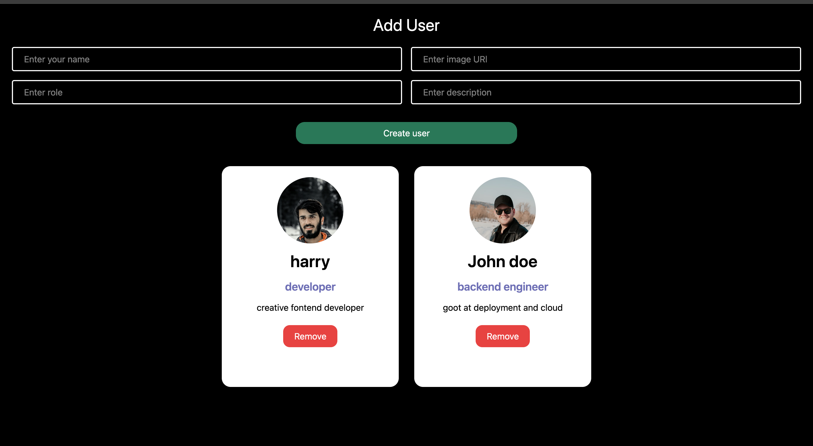

## 👥 React User Manager

A modern and beginner-friendly User Management application built using React. This project allows users to create, view, and delete user profiles with persistent storage using localStorage. It focuses on real-world React concepts such as controlled forms, state management, component-based architecture, and dynamic rendering.

🔗 Live Demo: https://react-user-manager-jade.vercel.app/

---

## 📸 Screenshot



> Add a screenshot of your app in the root folder and name it `screenshot.png`

---

## 🚀 Features

- Add users with name, image URL, role, and description
- Display users as responsive cards
- Delete users with confirmation prompt
- Persistent data using localStorage
- Controlled form inputs using React hooks
- Responsive layout built with Tailwind CSS

---

## 🛠️ Tech Stack

- React
- React Hooks (useState)
- Tailwind CSS
- Vite
- localStorage

---

## 📂 Project Structure
```
src/
├── components/
│   └── Card.jsx
├── App.jsx
├── main.jsx
├── index.css
```

---

## 🧠 Concepts Used

- Controlled components
- State management with useState
- Immutable state updates
- Component-based architecture
- Mapping arrays to UI
- Conditional rendering
- Data persistence using localStorage

---

## ⚙️ How It Works

1. User fills in the form with profile details
2. On form submission:
   - A new user object is created
   - The user is added to state immutably
   - Data is saved to localStorage
3. Users are rendered dynamically as cards
4. Each card includes a delete option with confirmation
5. User data remains after page refresh

---

## ▶️ Getting Started

Clone the repository:
```
git clone https://github.com/dev-hamza03/react-user-manager.git
```

Navigate to the project folder:
```
cd react-user-manager
```

Install dependencies:
```
npm install
```

Run the development server:
```
npm run dev
```

---

## 🎯 Future Improvements

- Edit user functionality
- Search and filter users
- Better form validation
- Dark mode support
- State management with Context API or Reducer

---

## 📖 Learning Outcome

This project helped in understanding real-world React workflows including form handling, state immutability, component communication via props, and client-side persistence. It serves as a strong foundation for building scalable React applications.

---

## 🙌 Acknowledgement

Built as part of my React learning journey. More features and improvements will be added in future updates.
